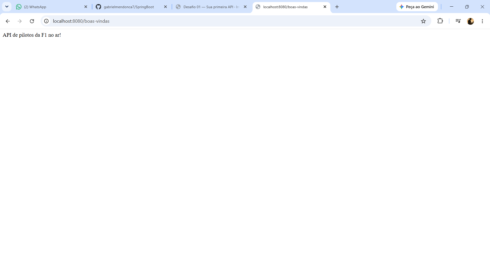
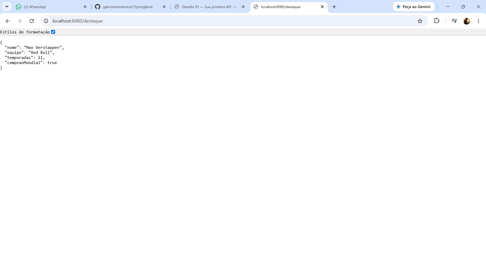
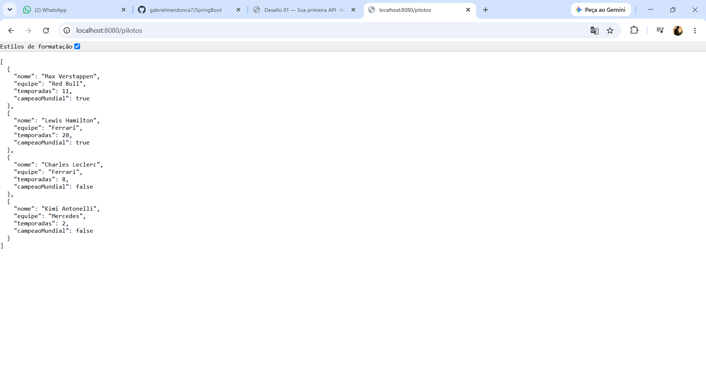

# 🏎️ API de Pilotos de Fórmula 1

<p align="center">
  <strong>Uma API REST desenvolvida com Java e Spring Boot para disponibilizar informações sobre pilotos de Fórmula 1.</strong>
</p>

<p align="center">
  
  
  
</p>

## 📖 Sobre o projeto

Este projeto foi desenvolvido como parte dos estudos de desenvolvimento de APIs REST utilizando Java e Spring Boot.

A aplicação apresenta informações sobre pilotos de Fórmula 1 e demonstra diferentes tipos de respostas que uma API pode retornar:

O projeto utiliza um `record` Java para representar os pilotos.

## 📋 Pré-requisitos

Antes de executar o projeto, certifique-se de ter instalado:

- Java JDK 21 ou superior
- Git
- IntelliJ IDEA ou outra IDE compatível

Verifique a instalação do Java:

```bash
java -version
```

O projeto utiliza o Maven Wrapper, portanto não é necessário instalar o Maven separadamente.

## 🚀 Como executar

### 1. Clone o repositório

```bash
git clone https://github.com/gabrielmendonca7/SpringBoot.git
```

Entre na pasta do projeto:

```bash
cd SpringBoot
```

### 2. Execute a aplicação

**🪟 Windows**
```bash
.\mvnw.cmd spring-boot:run
```

**🐧 Linux / macOS**
```bash
./mvnw spring-boot:run
```

Também é possível executar diretamente pela IDE através da classe `Formula1Application.java`.

### 3. Acesse a API

Após iniciar a aplicação, ela estará disponível em:

```
http://localhost:8080
```

## 🌐 Endpoints

A API possui atualmente três endpoints:

| Método | Endpoint | Retorno |
|---|---|---|
| 🟢 GET | `/boas-vindas` | Texto |
| 🟢 GET | `/destaque` | Objeto JSON |
| 🟢 GET | `/pilotos` | Array JSON com 4 pilotos |

## 🔎 Documentação dos endpoints

### 🟢 1. GET /boas-vindas

Endpoint responsável por apresentar uma mensagem de boas-vindas e verificar se a API está funcionando.

**Requisição**
```
GET http://localhost:8080/boas-vindas
```

**Resposta**
```
API de pilotos da F1 no ar!
```

**📸 Resultado**

<p align="center">
  
</p>

### 🟢 2. GET /destaque

Endpoint responsável por retornar um objeto do record `Piloto`.

O Spring Boot realiza automaticamente a conversão do objeto Java para JSON.

**Requisição**
```
GET http://localhost:8080/destaque
```

**Resposta**
```json
{
  "nome": "Max Verstappen",
  "equipe": "Red Bull",
  "temporadas": 11,
  "campeaoMundial": true
}
```

**📸 Resultado**

<p align="center">
  
</p>

### 🟢 3. GET /pilotos

Endpoint responsável por retornar uma lista com quatro pilotos.

A lista de objetos `Piloto` é automaticamente convertida pelo Spring Boot para um array JSON.

**Requisição**
```
GET http://localhost:8080/pilotos
```

**Resposta**
```json
[
  {
    "nome": "Max Verstappen",
    "equipe": "Red Bull",
    "temporadas": 11,
    "campeaoMundial": true
  },
  {
    "nome": "Lewis Hamilton",
    "equipe": "Ferrari",
    "temporadas": 20,
    "campeaoMundial": true
  },
  {
    "nome": "Charles Leclerc",
    "equipe": "Ferrari",
    "temporadas": 8,
    "campeaoMundial": false
  },
  {
    "nome": "Kimi Antonelli",
    "equipe": "Mercedes",
    "temporadas": 2,
    "campeaoMundial": false
  }
]
```

**📸 Resultado**

<p align="center">
  
</p>


### Atributos

| Campo | Tipo | Descrição |
|---|---|---|
| `nome` | String | Nome do piloto |
| `equipe` | String | Equipe do piloto |
| `temporadas` | int | Número de temporadas disputadas |
| `campeaoMundial` | Boolean | Indica se o piloto já foi campeão mundial |
